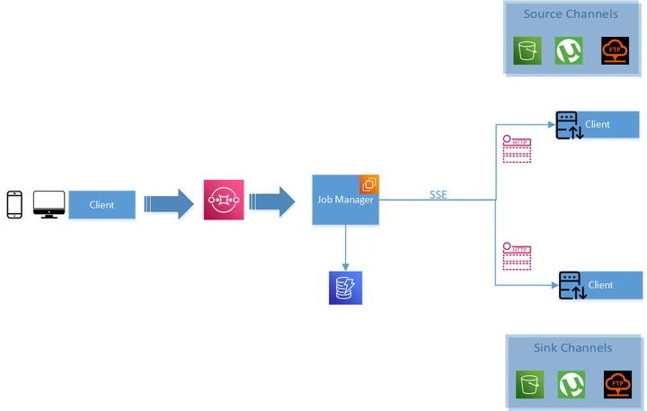

## Maggi

### Maggi Stacks
- [Maggi Dashboad](https://github.com/sangeethapradeep/maggi-dashbaord)
- [Maggi Launcher](https://github.com/code-krypt/maggi-launcher)

### Inspiration
Due to the pandemic, a lot of people have lost access to their high-powered workstations in the office and are forced to work on comparatively weaker hardware i.e. unless you were willing to transport the whole desk to your place or by investing in expensive cloud solutions, not exactly the easiest pills to swallow for most people. 
Having to wait 10 times the usual time for your code to compile definitely takes the magic out of the whole process. The challenge set by Logitech to re-imagine the future of digital work only further cemented our decision to work towards solving this problem. 
And with the world barrelling towards decentralized systems, it only seemed natural for us to progress down the same road. And that’s how we came up with Maggi, an open-source decentralized computing platform, aimed at bringing high-performance computing to you.

### What it does
Maggie is a community-driven decentralized platform for computing. Put simply, every user will have the ability to contribute as well as make use of the platform for their own creative purposes.
In the case of our MVP,
- Users will be able to submit their code as a text file using a storage method of their choice (torrents or S3 
buckets) as a job request.
- Suitable nodes on the network will then complete the request and send the output to the user.
- We also have a token reward system in place to incentivize users to contribute to the network.

### How we built it

### Challenges we ran into
As of now, we still haven’t managed to entirely decentralize it as we still require a master node to delegate job requests to suitable nodes. However, since the master node isn’t exactly involved in the computing process, we don’t consider this a dealbreaker.

### Accomplishments that we're proud of
We are definitely super proud of ourselves for coming up with an MVP in this short span of time. We certainly believe that this project has a lot of potential and definitely intend to work on this moving ahead.

### What's next for Maggi
We intend to have it be fully flexible to adapt to other domains as well in the future.
We also hope to implement a solution to make maggie completely decentralized, eliminating the need for a central master node.